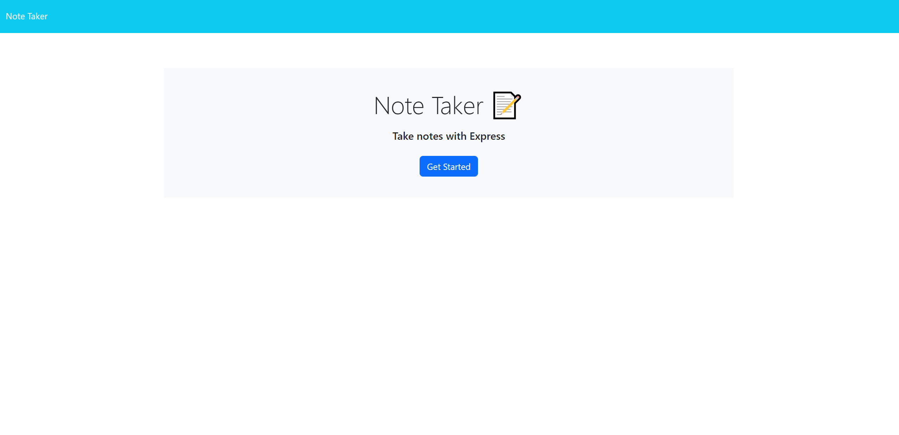
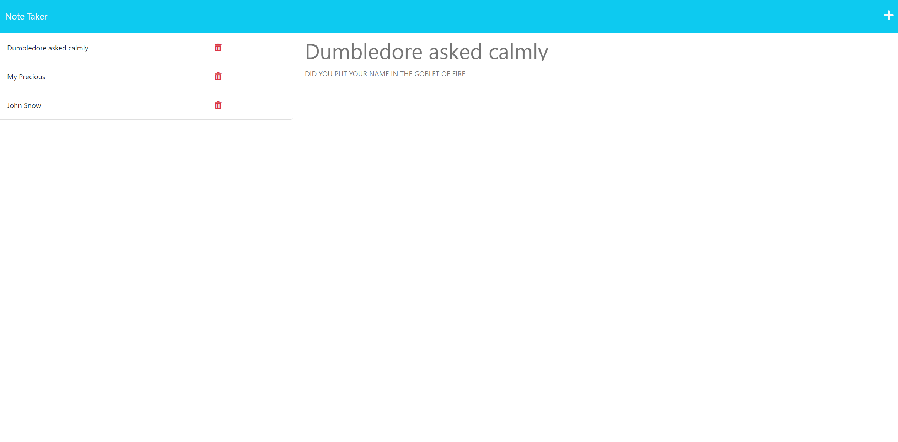

# Note-Taker

## Description

This app allows the user to add and delete custom notes using a local database to track and display the notes.

The deployed app can be found at:
>

## Table of Contents

- [Description](#description)
- [Installation](#installation)
- [Usage](#usage)
- [License](#license)
- [Contributions](#contributions)
- [Questions](#questions)

## Installation

1. Clone this repo onto your system

2. Run `npm install` to install all dependencies

3. Run `npm start` to start the app

4. Go to <http://localhost:3333>

5. Take Notes!

## Usage

This app can be used to create and delete notes for your everyday life.

## License

This project is under the license of MIT.

## Contributions

Starter code obtained from: <https://github.com/coding-boot-camp/miniature-eureka>

## Questions

GitHub account:

>[https://github.com/HunterMuratore](https://github.com/HunterMuratore)

Reach me through email here to ask any questions about the app!

>Email: [muratoreh@gmail.com](mailto:muratoreh@gmail.com)
